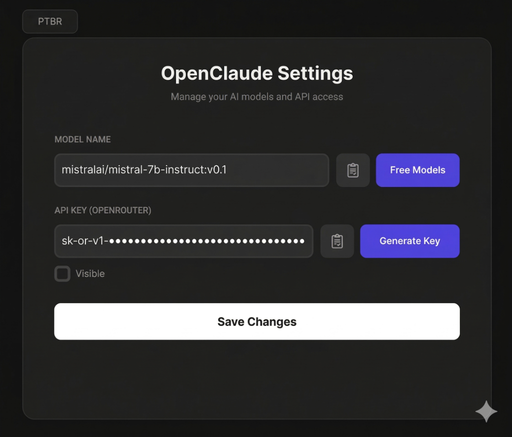

# OpenClaude Models Manager ⚙️

A modern GUI tool built to simplify and manage your **OpenClaude** environment settings. Edit API keys, choose models dynamically, and integrate everything seamlessly — without ever touching local system files manually.

<p align="center">
  
</p>

## 🚀 Key Features

* **Premium GUI:** Built with `customtkinter`, featuring a sleek *Pitch Black / OLED Minimalist* dark theme for visual comfort and focus.
* **Auto File Management:** Fully autonomous. It automatically creates and manages the `settings.json` file in your native user directory (`~/.claude/`), preventing accidental deletions or broken paths.
* **Dynamic i18n:** Native real-time language switching (no restart needed) between English (EN) and Portuguese (PTBR).
* **OpenRouter Integration:** Built-in shortcut buttons — `Free Models` to browse free models and `Generate Key` to jump straight to the OpenRouter dashboard.
* **Clipboard Helpers:** One-click paste buttons (`📋`) for quick API key insertion, plus a secure password mask toggle for your credentials.

## 🛠️ Tech Stack

* **Python 3.x**
* **Libraries:** `customtkinter`, `json`, `os`, `webbrowser`, `sys`

## 📦 Getting Started

**1. Install dependencies:**
```bash
pip install customtkinter
```

**2. Run the Manager:**
```bash
python config_manager.py
```

**3. Configure:**
Select your preferred model, paste your API key, and click **Save Changes**. The app writes directly to `~/.claude/settings.json`, ready to be consumed by your terminal processes.

<br/>

> **Note:** No need to create a `.json` file beforehand. The app automatically generates a clean default template on first launch.
